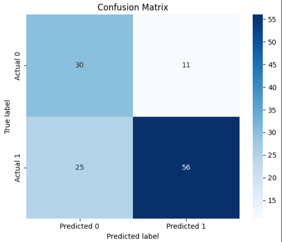

# Isolation Forest Algorithm for Anomaly Detection in DLP printing
Isolation Forest is a recursive partitioning ensemble algorithm that creates multiple decision trees to identify anomalies. Anomalies are data points that differ significantly from the rest of the dataset, making them outliers. In this experiment, I used Isolation Forest to highlight unsual printing configurations that would most likely result in a printing failure. The [1] dataset provided by Mendeley Data contains orientation-based 3D printing parameters data, extracted from sterolithography prints.

# Methodology
While Isolation Forest is designed to identify anomalies; not all anomalies (outliers) are actual print failures, and not all print failures appear as statistical outliers.

To overcome the lack of labeled failure data, I developed a pseudo-failure label using domain-specific rules. This involved encoding known risk patterns in SLA/DLP printing into a new binary feature, likely_failure, based on thresholds such as:

- Wair > 0 or Wair_partial > 0 → presence of unsupported walls
- Farea < threshold → small initial contact area risking poor bed adhesion
- offset > threshold → large shifts in the center of gravity across layers
- Fwall == 0 → first wall not printed on the bed
- needsupport == 1 → geometries requiring support structures

The 'likely_failure' feature serves as a proxy for ground truth, allowing me to evaluate the effectiveness of the Isolation Forest model using classification metrics (e.g precision, recall)

# Current Results

```
              precision    recall  f1-score   support

           0       0.55      0.73      0.62        41
           1       0.84      0.69      0.76        81

    accuracy                           0.70       122
   macro avg       0.69      0.71      0.69       122
weighted avg       0.74      0.70      0.71       122
```



Recall is emphasized as the primary performance metric, given the objective of the system: **to identify and flag as many failure-prone configurations as possible**. This emphasis is intended to minimize the number of faulty prints produced, thereby conserving material, time, and operational resources by prioritizing the indetification of configuration that are more likely to result in print failures.

# References
[1] Patil, Sonali Sagar; Thite, Sandip; Deshpande, Yogesh; Parle, Dattatraya  (2025), “Orientation-Based Analysis of 3D Printing Parameters and Quality Control”, Mendeley Data, V3, doi: 10.17632/93bdmx2b7p.3
